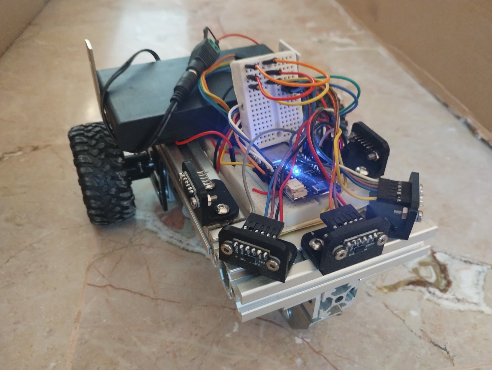
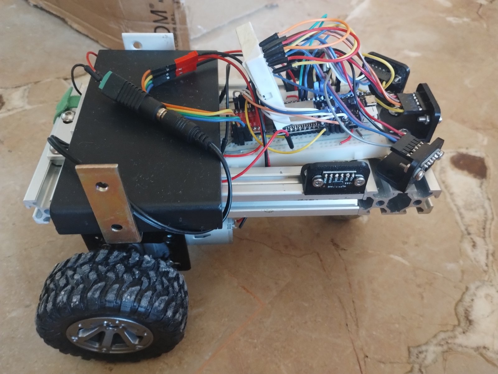
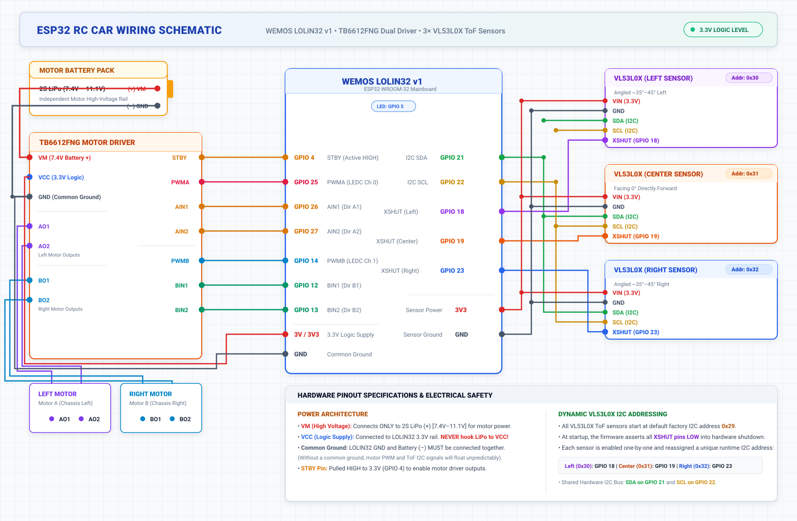
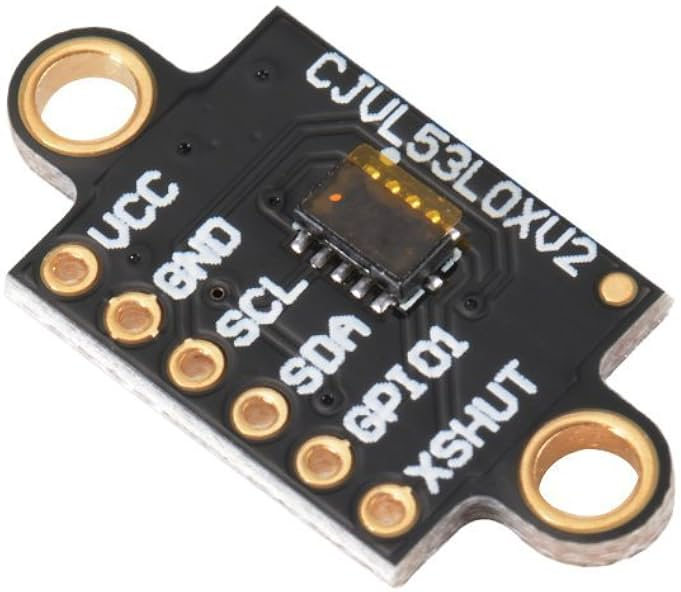
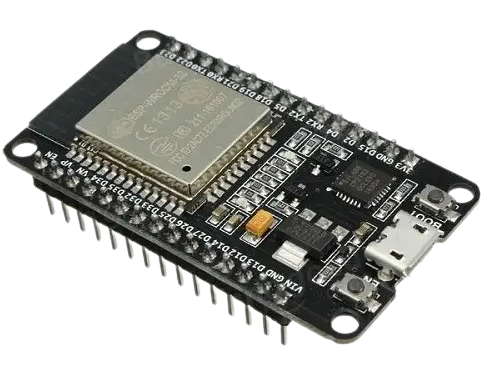
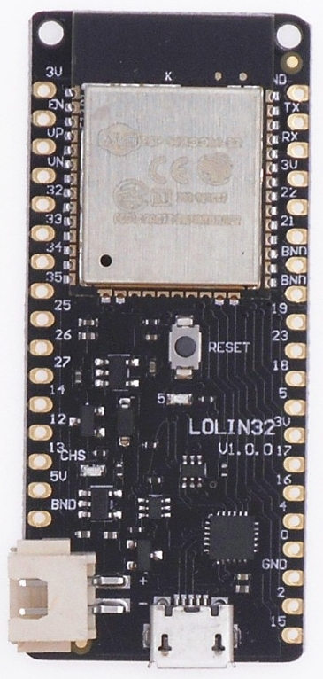
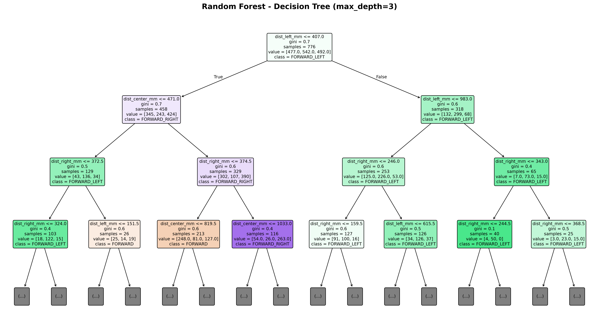

<!-- Slide 1: Title Slide -->

  <h1 style="font-size: 40px; margin-top: 14px; margin-bottom: 6px;">Auto RC Autonoma con ESP32 &amp; ML</h1>
  

    Behavioral Cloning tramite Sensori ToF Laser e Telemetria ESP-NOW in Tempo Reale
  

  

    

      <strong>Componenti principali</strong> ESP32 + TB6612FNG
    

    

      <strong>Sistema wireless</strong> ESP-NOW @ 50 Hz
    

    

      <strong>Sensori</strong> 3× Laser ToF VL53L0X
    

    

      <strong>Machine Learning</strong> Random Forest
    

  

<!--
Presenter Notes:
- Dare il benvenuto al pubblico e introdurre il progetto.
- Esporre l'obiettivo principale: realizzare una guida autonoma in tempo reale su hardware a basso costo tramite il behavioral cloning (apprendimento per imitazione).
-->

---

<!-- Slide 2: Project Introduction -->

## Panoramica e Obiettivi del Progetto

  

    <h3 style="color: #1e40af;">Obiettivo</h3>
    <ul>
      <li><strong>Navigazione Autonoma:</strong> Consentire a un veicolo RC di percorrere un tracciato delimitato da pareti senza GPS né telecamere.</li>
      <li><strong>Behavioral Cloning:</strong> Addestrare modelli di machine learning direttamente dalle dimostrazioni di guida umana.</li>
      <li><strong>Rilevazione ambiente a basso costo:</strong> Sostituire LiDAR pesanti o sistemi di visione con sensori di distanza Time-of-Flight laser leggeri ed economici.</li>
    </ul>
  

  

    <h3 style="color: #047857;">Caratteristiche</h3>
    <ul>
      <li><strong>Architettura distribuita:</strong> Il veicolo gestisce il controllo motori e la lettura sensori; il PC esegue l'inferenza del modello di Machine Learning.</li>
      <li><strong>Wireless:</strong> Protocollo dedicato ESP-NOW per eliminare il sovraccarico di router o access point Wi-Fi.</li>
    </ul>
  

  <strong>Risultato Chiave:</strong> Guida autonoma continua con perfetto evitamento delle pareti basata esclusivamente su 3 valori di distanza.

<!--
Presenter Notes:
- Spiegare la motivazione: perché le telecamere non sono sempre necessarie per la navigazione su tracciati.
- Evidenziare il behavioral cloning: apprendere la politica di guida da un pilota umano esperto.
- Menzionare il design distribuito: mantenere leggero il payload del veicolo eseguendo il modello sul PC host via radio ad alta frequenza.
-->

---

<!-- Slide 3: The Physical Vehicle Platform -->

## Il dispositivo

  

    <ul>
      <li><strong>Guida a trazione differenziale:</strong> Due motori DC indipendenti con riduzione e ruota libera.</li>
      <li><strong>Array frontale di sensori:</strong> 3× sensori laser Time-of-Flight (ToF) disposti a ventaglio per un ampio cono visivo. I sensori usano il protocollo I2C che semplifica il cablaggio.</li>
      <li><strong>Alimentazione a batteria:</strong> Alimentazione motori ad alta corrente separata dall'alimentazione logica a 3.3V.</li>
    </ul>
  

  

    
  

<!--
Presenter Notes:
- Mostrare la disposizione fisica nella foto: i 3 sensori frontali (inclinato a sinistra, centrale dritto, inclinato a destra).
- Sottolineare il baricentro basso e la collocazione sicura del pacco batterie.
-->

---

<!-- Slide 4: Vehicle Chassis & Hardware Integration -->

## Chassis del veicolo

  

    
  

  

    

      <h3 style="margin-top: 0; font-size: 16px;">Microcontroller</h3>
      

        <strong>ESP32 (WEMOS LOLIN32 v1)</strong>: gestisce i sensori, la generazione PWM per i motori e la comunicazione RF bidirezionale.
      

    

    

      <h3 style="margin-top: 0; font-size: 16px;">Controllo motori</h3>
      

        <strong>Driver H-bridge TB6612FNG</strong> con MOSFET ad alta efficienza per controllare i due motori DC.
      

    

    

      <h3 style="margin-top: 0; font-size: 16px;">Alimentazione</h3>
      

        <strong>Regolatore di tensione step-down MP1584</strong>: converte la tensione della batteria a 10V nei 5V stabili per alimentare l'ESP32.
      

    

  

<!--
Presenter Notes:
- Illustrare la vista laterale mostrando la posizione della batteria, del driver motori e del convertitore buck.
- Sottolineare la modularità: i singoli componenti possono essere sostituiti o manutenuti senza smontare lo chassis.
-->

---

<!-- Slide 5: System Architecture -->

## Architettura di Sistema End-to-End

  
    Controller Xbox ➔ PC Host (Python ML) ➔ Seriale USB ➔ Dongle ESP32 ➔ [ESP-NOW] ➔ ESP32 Auto ➔ Motori
  

  

    <h3 style="margin-top: 0;">💻 ESP32 collegato al PC (dongle)</h3>
    <ul>
      <li>Dongle USB ESP32 DevKit v1 come ponte RF bidirezionale.</li>
      <li>Script Python riceve la telemetria via porta seriale USB.</li>
      <li>Esegue l'inferenza Random Forest in tempo reale a ~30 Hz.</li>
      <li>Controller Xbox per controllo manuale e override di sicurezza.</li>
    </ul>
  

  

    <h3 style="margin-top: 0;">🚗 ESP32 sul veicolo</h3>
    <ul>
      <li>Campiona i 3 sensori ToF a ~50 Hz.</li>
      <li>Trasmette pacchetti tramite protocollo ESP-NOW.</li>
      <li>Riceve comandi di sterzata e genera segnali PWM.</li>
      <li>Supporta la frenata automatica d'emergenza</li>
    </ul>
  

<!--
Presenter Notes:
- Spiegare la suddivisione computazionale: l'ESP32 gestisce le operazioni I/O a basso livello (PWM, bus I2C), mentre il PC elabora dati e inferenza ML.
- Evidenziare la bassissima latenza del collegamento radio che connette i due mondi.
-->

---

<!-- Slide 6: Hardware Wiring Schematic -->

## Schema Completo dei Collegamenti Elettrici

  

<!--
Presenter Notes:
- Fare riferimento allo schema mostrato a schermo.
- Enfatizzare la sicurezza elettrica: il circuito motori ad alto assorbimento è isolato dalla logica delicata dei sensori.
- Ricordare l'importanza della massa comune per la pulizia dei segnali I2C e PWM.
-->

---

<!-- Slide 7: Perception Layer - Time-of-Flight Sensors -->

## Percezione: 3× Sensori ToF Laser VL53L0X

  

    <ul>
      <li><strong>Precisione Millimetrica:</strong> Misurazione ottica a impulsi laser infrarossi (immune a falsi echi acustici o colori della parete).</li>
      <li><strong>Disposizione Angolare a Ventaglio:</strong>
        <ul>
          <li><strong>Sinistro:</strong> Angolato verso l'esterno a ~35°–45°</li>
          <li><strong>Centrale:</strong> Rivolto dritto in avanti (0°)</li>
          <li><strong>Destro:</strong> Angolato verso l'esterno a ~35°–45°</li>
        </ul>
      </li>
      <li><strong>Inizializzazione Dinamica Sequenziale I2C:</strong>
        <ul>
          <li>Tutti i sensori si avviano con l'indirizzo predefinito <code>0x29</code>.</li>
          <li>L'ESP32 porta i pin XSHUT a livello LOW tenendoli in reset.</li>
          <li>I sensori vengono riattivati uno alla volta e riassegnati agli indirizzi <code>0x30</code>, <code>0x31</code> e <code>0x32</code>.</li>
        </ul>
      </li>
    </ul>
  

  

    
  

<!--
Presenter Notes:
- Spiegare perché non sono stati utilizzati sensori a ultrasuoni: gli ultrasuoni generano coni ampi, zone d'ombra e hanno frequenze di campionamento inferiori.
- Descrivere l'indirizzamento dinamico: il chip VL53L0X ha un indirizzo fisso all'avvio, risolto con la sequenza di boot via GPIO XSHUT.
-->

---

<!-- Slide 8: Wireless Communication Layer - ESP-NOW -->

## Ponte Wireless: Protocollo ESP-NOW

  

    <ul>
      <li><strong>RF 2.4 GHz Connectionless:</strong> Protocollo a livello MAC senza router o AP.</li>
      <li><strong>Latenza Ultra-Bassa (&lt;3 ms):</strong> Ciclo chiuso deterministico a <strong>50 Hz</strong>.</li>
      <li><strong>Uplink (Auto ➔ PC):</strong> Distanze 3× ToF in tempo reale <code>[sx, centro, dx]</code>.</li>
      <li><strong>Downlink (PC ➔ Auto):</strong> Comandi di sterzata e duty cycle PWM.</li>
      <li><strong>Zero Disconnessioni:</strong> Link diretto peer-to-peer immune da interferenze Wi-Fi.</li>
    </ul>
  

  

    

      
      
Dongle PC (Seriale USB)

      
ESP32 DevKit v1

    

    

      
⇅

      <strong style="color: #15803d; font-size: 13px;">📡 Protocollo ESP-NOW 2.4 GHz</strong>
      
Latenza &lt;3 ms • Zero router • Ciclo 50 Hz

    

    

      
      
Nodo Veicolo (Ricevitore)

      
WEMOS LOLIN32 v1

    

  

<!--
Presenter Notes:
- Confrontare ESP-NOW con Wi-Fi standard o WebSocket: nessuna negoziazione IP, nessuna disconnessione, consegna istantanea dei pacchetti.
- Il dongle elimina la necessità di schede radio dedicate sul PC; viene visto come una normale porta seriale USB.
-->

---

<!-- Slide 9: Behavioral Cloning Pipeline -->

## Fase 1: Teleoperazione e Acquisizione Dati

  

    <h3 style="margin-top: 0;">🎮 Dimostrazione Umana</h3>
    <ul>
      <li>Il pilota guida il veicolo lungo la pista utilizzando un <strong>Controller Xbox</strong>.</li>
      <li>Curve fluide ed evitamento ostacoli dimostrati con la fisica reale (inerzia, attriti e riflessioni).</li>
      <li>Teleoperazione gestita tramite <code>manual_control.py</code>.</li>
    </ul>
  

  

    <h3 style="margin-top: 0;">📊 Registrazione Dataset Sincronizzato</h3>
    <ul>
      <li>Telemetria campionata e registrata in continuo durante la guida:</li>
    </ul>
    

      dist_sx, dist_centro, dist_dx ➔ direzione 
      284, 850, 610 ➔ FORWARD 
      142, 380, 790 ➔ FORWARD_RIGHT 
      820, 210, 115 ➔ FORWARD_LEFT
    

  

  <strong>Principio Chiave:</strong> Vengono usate per il training solo le triplette di distanza spaziale — timestamp e throttle assoluto vengono rimossi per evitare l'overfitting.

<!--
Presenter Notes:
- Spiegare l'apprendimento per imitazione: la macchina apprende la policy osservando le azioni di un pilota umano.
- Sottolineare l'igiene dei dati: rimuovere timestamp e velocità permette al modello di mappare puramente la geometria dello spazio sulle decisioni di guida.
-->

---

<!-- Slide 10: Machine Learning Model Training -->

## Fase 2: Addestramento del Modello Supervisionato

  

    <ul>
      <li><strong>Modello:</strong> Random Forest Classifier (Insieme di Alberi Decisionali).</li>
      <li><strong>Feature di Ingresso:</strong> Tripletta di distanze <code>[dist_sinistra, dist_centro, dist_destra]</code> (mm).</li>
      <li><strong>Classi di Output:</strong> <code>FORWARD</code>, <code>FORWARD_LEFT</code>, <code>FORWARD_RIGHT</code>.</li>
      <li><strong>Perché il Random Forest?</strong>
        <ul>
          <li>Modella naturalmente confini di decisione non lineari.</li>
          <li>Alta robustezza contro rumore dei sensori e outlier temporanei.</li>
          <li>Inferenza sub-millisecondo su CPU ordinaria.</li>
        </ul>
      </li>
      <li><strong>Esportazione:</strong> Modello serializzato in <code>pilot_model.pkl</code> tramite joblib.</li>
    </ul>
  

  

    <h3 style="margin-top: 0; color: #047857; font-size: 16px;">Logica Decisionale Appresa</h3>
    

      

        <strong>Ostacolo a Sinistra:</strong> <code>dist_sx &lt; dist_dx</code> ➔ Sterza <strong>FORWARD_RIGHT</strong>
      

      

        <strong>Corridoio Libero:</strong> <code>dist_centro &gt; soglia</code> ➔ Marcia <strong>FORWARD</strong>
      

      

        <strong>Ostacolo a Destra:</strong> <code>dist_dx &lt; dist_sx</code> ➔ Sterza <strong>FORWARD_LEFT</strong>
      

    

  

<!--
Presenter Notes:
- Spiegare che il Random Forest è stato preferito alle reti neurali poiché si addestra in pochi secondi, non richiede GPU per l'inferenza e non soffre di overfitting su dataset compatti.
-->

---

<!-- Slide 11: Decision Tree Architecture & Interpretability -->

## Struttura dell'Albero Decisionale (Random Forest)

  
  

    <strong>Interpretabilità del Modello:</strong> Le diramazioni mostrano chiaramente le soglie geometriche (in mm) dei sensori ToF per la scelta di direzione (<code>FORWARD</code>, <code>FORWARD_LEFT</code>, <code>FORWARD_RIGHT</code>).
  

<!--
Presenter Notes:
- Evidenziare la white-box interpretability: a differenza delle "black box" deep learning, qui ogni bivio riflette una regola geometrica precisa.
- Mostrare la radice: il primo test discrimina la vicinanza alla parete sinistra (dist_left_mm <= 407 mm).
- Spiegare come il forest combini 150 di questi alberi con voto di maggioranza per massimizzare la robustezza al rumore.
-->

---

<!-- Slide 12: Autonomous Inference in Action -->

## Fase 3: Autopilota Autonomo in Tempo Reale

  

    <h3 style="margin-top: 0;">Sistema di autopilotaggio</h3>
    <ul>
      <li><code>autopilot.py</code> riceve la telemetria live dei 3 ToF dal dongle.</li>
      <li>Esegue l'inferenza con i dati ricevuti usando il modello pre-allenato <code>pilot_model.pkl</code>.</li>
      <li>Prevede la direzione corretta a circa 30 Hz.</li>
      <li>Invia il pacchetto di comando al veicolo tramite ESP-NOW.</li>
    </ul>
  

  

    <h3 style="margin-top: 0;">Sistemi di sicurezza</h3>
    <ul>
      <li><strong>Frenata pre-collisione:</strong> Arresto istantaneo se la distanza frontale scende sotto la soglia di sicurezza (<code>&lt; 120 mm</code>).</li>
      <li><strong>Override manuale:</strong> Muovere le levette del controller Xbox disattiva istantaneamente la modalità autonoma.</li>
      <li><strong>Timeout di connessione:</strong> Il veicolo si ferma automaticamente in caso di perdita del segnale radio (&gt;500 ms).</li>
    </ul>
  

<!--
Presenter Notes:
- Illustrare i tre livelli di sicurezza: frenata automatica di emergenza, override immediato dal joystick e protezione da perdita del segnale.
- Questa architettura garantisce test sicuri senza danneggiare il veicolo contro le pareti.
-->

---

<!-- Slide 13: Demonstration Video -->

## Dimostrazione di Guida Autonoma sul Tracciato

  <video controls width="720" style="max-height: 350px; border-radius: 10px; box-shadow: 0 4px 16px rgba(0,0,0,0.15); border: 2px solid #cbd5e1;" preload="metadata">
    <source src="autopilot.mp4" type="video/mp4">
    Il tuo browser non supporta il tag video.
  </video>
  

    📹 <strong>Giro in Pista Reale:</strong> Zero intervento umano — la traiettoria si adatta dinamicamente alle letture in tempo reale dei 3 sensori ToF.
  

<!--
Presenter Notes:
- Avviare il video durante l'esposizione orale.
- Mostrare la fluidità con cui l'auto affronta le curve della pista.
- Sottolineare che la velocità di avanzamento rimane costante mentre le correzioni di traiettoria avvengono in tempo reale.
-->

---

<!-- Slide 14: Summary & Key Takeaways -->

## Riepilogo e conclusioni

  <h3 style="color: #1e40af; font-size: 21px; margin-bottom: 12px;">Risultati principali del progetto</h3>
  <ul>
    <li><strong>Imitation Learning:</strong> Dimostrato che compiti complessi di navigazione e mantenimento della corsia possono essere appresi direttamente dai dati raccolti durante il controllo umano.</li>
    <li><strong>Sensori precisi a basso costo:</strong> 3 sensori laser Time-of-Flight offrono un'accuratezza elevata senza algoritmi pesanti di computer vision.</li>
    <li><strong>Controllo wireless:</strong> ESP-NOW garantisce una latenza ridotta e maggiore affidabilità rispetto a wifi e bluetooth</li>
  </ul>

<!--
Presenter Notes:
- Concludere riassumendo il valore dell'architettura proposta.
- Ribadire come l'unione di sensori laser essenziali, wireless ad alta velocità e Machine Learning supervisionato crei una piattaforma robotica affidabile e riproducibile.
- Aprire la sessione di domande con il pubblico.
-->
